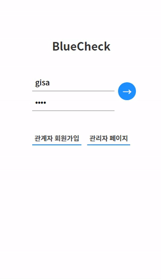
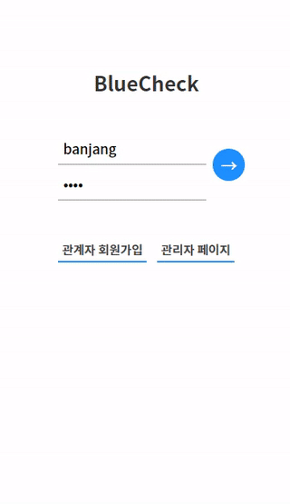

## BlueCheck
🔨아파트 유지보수 시스템 (아웃소싱 프로젝트) / Apartment Maintenance System

## Preview

- Manager (기사)

    

- Repairman (작업반장)

    


## Stack
`Node.js` `VanillaJS` `HTML5/CSS3` `MySQL` `Docker` `React-native` `Firebase`

## Usage

### Requirement
> `git` `Docker` `MySQL(or Maria) Database Docker`


### Clone this git
```git clone https://github.com/zinirun.BlueCheck.git```

### Setup your database at your git repository
- Open vim editor 
```vi makeapp.sh```  
- Edit script at `--link` for running docker container  
```--link YOUR_DB_NAME:db```
- Run shellscript at your git repository
```chmod +x makeapp.sh; ./makeapp.sh```


### After running service
- Attach Docker Container
```docker exec -it bc-app```
- View Node logs
```docker logs bc-app```
